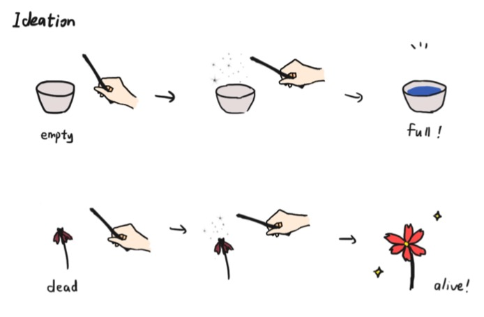
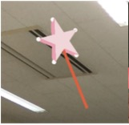
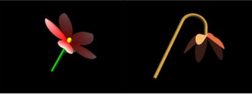
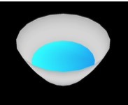
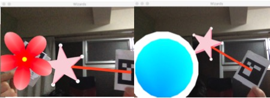

# Wizard

You can see the slides [there](Wizard.pdf)
## Motivation
Have you ever imagine you can hold a wand and change something like a Wizard? We can realize your dream!

In this repository, we made an AR system based on AR markers, OpenCV and OpenGL. You can use a marker as the wand, touch the empty cup or dead flower, then you can make the cup full of water, or make the dead flower alive.
  
Just like this magic picture drawn by Yuke!

## Workflow

### Markers
First of all, we use three different markers in this project, and use OpenCV to track and estimate the pose of the markers.
* Path: ``res/xx.png``
	* 21ee -> wand
	* 14b7 -> cup
	    * empty & full of water
	* 1d59 -> flower
	    * dead and bloom
  

### Distance
After we find the specific markers, we will calculate the distance between the wand marker and the object marker. We compare this distance to the distance from previous frame to decide the current state of the object.
* Offset = from **wand top** to **wand-marker center**
* Center_distance = from **wand-marker center** to **object marker center**
* Distance = Center_distance + Offset

### Models
We made different models for wand, flower and cup

#### wand

#### flower（dead & alive）

#### cup (with water)

### Final results

## Contributors:  
* [Xu Ruopeng](https://github.com/Bigphess)
	* Make the wand model
	* Combine marker pose detection 
* [Wang Yuke](https://github.com/yukekeke)
	* Magic cup model with water
	* Slides for presetation
* [Saito Tatsuhiko](https://github.com/katzeallergie)
	* Alive and dead flower models
* [Tanaka Yuka](https://github.com/tanakayuka)
	* Markers distance detection code  

## Learning Materials
[Learning OpenGL](https://learnopengl.com/Introduction)
